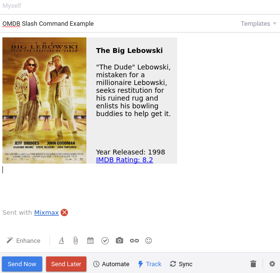

# Open Movie Database Slash Command for Mixmax

## Description 

This is an open source Mixmax Slash Command, that will search www.omdbapi.com, an online database for both Movie's and Television Series, and provide you with a brief plot summary, the year it was released, as well the IMDB rating which links to the results IMDB page for further info.



 See <http://developer.mixmax.com/docs/overview-slash-commands> for more information about how to use this example code in Mixmax. 


## Technologies Used 
- JavaScript 
- Node Express Server 
- Synchronize 
- Request

This was a fun project as it was my first experience using Node Express for a server, as well as the accompanying packages. I've primarily utizlied rails' WEBrick or Puma servers, but have been wanting to learn about Node Express, so enjoyed that.

## Running locally

1. Install using `npm install`
2. Run using `npm start` or `node server.js`

To simulate locally how Mixmax calls the typeahead URL (to return a JSON list of typeahead results), run:

```
curl http://localhost:9145/typeahead?text=alcatraz
```

or in your browser navigate to:
```
http://localhost:9145/typeahead?text=alcatraz
```

To simulate locally how Mixmax calls the resolver URL (to return HTML that goes into the email), run:

```
curl http://localhost:9145/resolver?text=alcatraz
```

or in your browser navigate to: 

```
http:/localhost:9145/resolver?text=alcatraz
```
If you wish to install the slash command to your current Mixmax slash commands, please follow these instructions:

 1. git clone http://github.com/brentluna/mixmax-omdb-slash
 2. Run `npm install` and `npm start` or `node server.js`
 3. Verify it works by visiting http://localhost:9145/typeahead?text=alcatraz and http://localhost:9145/resolver?text=alcatraz in your browser. 
 4. Open up your Mixmax Dashboard (settings > integrations< Add Slash command)
 5. Enter the following inputs 

| Input Name            |  Value                         |
|-----------------------|:------------------------------:|
| Name                  | My OMDB Search                 |
| Command			          | omdb                           |
| Paramater placeholder | [Search]                       |
| Typeahead API URL     | http://localhost:9145/resolver |
| Resolver API URL      | http://localhost:9145/resolver |


## TODO 

- Update styling
- Get the tests in the test branch working, merge into master
